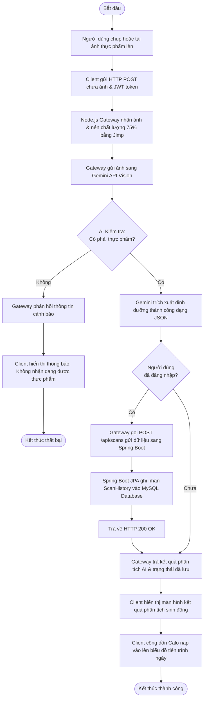

# BÁO CÁO TỔNG HỢP: THIẾT KẾ VÀ PHÂN TÍCH HỆ THỐNG AI NUTRISCAN

## THÔNG TIN ĐỀ TÀI & THÀNH VIÊN NHÓM
* **Đề tài:** Hệ thống phân tích và theo dõi dinh dưỡng thực phẩm thông minh – **AI NutriScan**
* **Thành viên nhóm:** 
  1. **Trần Việt Huy** (MSSV: 22... - Trưởng nhóm & Phát triển chính)
  2. *[Thành viên 2]* (MSSV: ...)
  3. *[Thành viên 3]* (MSSV: ...)

---

## 1. Giới thiệu Đề tài & Kiến trúc Hệ thống
Hệ thống **AI NutriScan** là giải pháp hỗ trợ chăm sóc sức khỏe chủ động thông qua việc kiểm soát chế độ dinh dưỡng hàng ngày. Ứng dụng tích hợp mô hình trí tuệ nhân tạo (AI) giúp nhận diện món ăn từ hình ảnh và bóc tách các thành phần đa lượng (Carbs, Protein, Fat, Calories, Điểm lành mạnh). Hệ thống cung cấp các chức năng quản lý kế hoạch bữa ăn, theo dõi chỉ số thể trạng và danh sách mua sắm, giúp người dùng xây dựng lối sống khoa học.

### Kiến trúc công nghệ
* **Frontend:** React.js, TailwindCSS, Vite (Giao diện người dùng responsive).
* **Backend:** Spring Boot (Java 17), Spring Security, Hibernate (JPA), JWT (Xác thực và phân quyền).
* **AI Gateway:** Node.js (Express), Jimp (Co kích thước & nén ảnh), Gemini API (Gemini Vision Model nhận dạng thực phẩm).
* **Cơ sở dữ liệu:** MySQL (Lưu trữ quan hệ).

---

## 2. Các Chức năng Chi tiết của Hệ thống
Hệ thống loại bỏ hoàn toàn các khái niệm chung chung bằng cách chia nhỏ thành các tác vụ cụ thể:

* **Module Xác thực:**
  - *Đăng ký:* Người dùng tạo tài khoản mới bằng email và mật khẩu.
  - *Đăng nhập:* Xác thực tài khoản, trả về JWT token phục vụ lưu trữ phiên làm việc.
  - *Đăng xuất:* Hủy phiên làm việc và xóa JWT khỏi bộ nhớ trình duyệt.
  - *Thông tin cá nhân:* Xem thông tin tài khoản, chiều cao, mục tiêu calo.
  - *Cập nhật hồ sơ:* Sửa đổi họ tên, thay đổi mật khẩu.
* **Module Nhận diện AI:**
  - *Chụp ảnh:* Kích hoạt camera thiết bị để chụp hình món ăn trực tiếp.
  - *Tải ảnh:* Chọn hình ảnh món ăn sẵn có từ thư viện ảnh của thiết bị.
  - *Tối ưu hóa ảnh:* Nén dung lượng (chất lượng 75%) và chỉnh kích thước (rộng tối đa 800px) để giảm tải băng thông.
  - *Nhận diện AI:* Gửi ảnh sang Gemini API để phân loại thực phẩm và bóc tách thành phần dinh dưỡng.
  - *Xem kết quả phân tích:* Hiển thị trực quan các biểu đồ dinh dưỡng tròn (macros chart) và điểm sức khỏe thực phẩm.
  - *Lưu lịch sử:* Tự động ghi chép dữ liệu quét vào cơ sở dữ liệu nếu tài khoản đã đăng nhập.
* **Module Nhật ký Sức khỏe:**
  - *Ghi nhận cân nặng:* Nhập chỉ số trọng lượng cơ thể hàng ngày.
  - *Tính toán chỉ số BMI:* Tự động tính toán dựa trên chiều cao và cân nặng ghi nhận.
  - *Ghi nhận nước uống:* Theo dõi lượng nước nạp vào tính bằng ml.
  - *Ghi nhận vận động:* Lưu số phút tập luyện tích cực trong ngày.
  - *Xem biểu đồ tuần:* Trực quan hóa xu hướng tăng/giảm cân nặng và các chỉ số thể chất.
* **Module Kế hoạch Bữa ăn:**
  - *Lập thực đơn:* Thiết lập kế hoạch ăn uống hàng ngày/hàng tuần.
  - *Thêm bữa ăn:* Đưa các món ăn cụ thể vào danh mục bữa Sáng, Trưa, Chiều, Tối hoặc Bữa phụ.
  - *Xóa bữa ăn:* Loại bỏ món ăn đã lập lịch khỏi danh sách thực đơn ngày.
  - *Theo dõi mục tiêu:* Tính toán tổng calo dự kiến của các bữa ăn đối chiếu với mục tiêu đề ra.
* **Module Danh sách Mua sắm:**
  - *Thêm nguyên liệu:* Ghi chép thực phẩm hoặc nguyên liệu cần mua.
  - *Phân loại cửa hàng:* Gán nhãn địa điểm cần mua (siêu thị, chợ hải sản, tạp hóa).
  - *Đánh dấu đã mua:* Tick chọn hoàn thành các mặt hàng đã bỏ vào giỏ.
  - *Xóa nguyên liệu:* Loại bỏ các mục không còn nhu cầu mua sắm.
* **Module Quản trị (Admin Dashboard):**
  - *Thống kê hệ thống:* Xem số lượng tài khoản, tổng số lượt quét, số admin và số user hoạt động.
  - *Xem danh sách tài khoản:* Liệt kê thông tin chi tiết tất cả người dùng trong hệ thống.
  - *Khóa/Mở khóa tài khoản:* Vô hiệu hóa hoặc khôi phục quyền truy cập của người dùng vi phạm.
  - *Phân quyền tài khoản:* Thay đổi role trực tiếp giữa `ROLE_USER` và `ROLE_ADMIN`.
  - *Xem toàn bộ lịch sử quét:* Theo dõi nhật ký quét thực phẩm của tất cả các tài khoản trên hệ thống.
  - *Quản lý thư viện thực phẩm:* Thêm thực phẩm mới, chỉnh sửa thông số dinh dưỡng hoặc xóa thực phẩm trong danh mục thư viện dùng chung.
  - *Điều chỉnh cấu hình:* Cập nhật cấu hình cài đặt hệ thống.

---

## 3. Phân quyền Người dùng & Sơ đồ Use Case Chi tiết

### 3.1 Bảng phân quyền hệ thống (RBAC)

| Tác nhân (Actor) | Mô tả vai trò | Các Use Case cụ thể (Chức năng chi tiết) |
| :--- | :--- | :--- |
| **Khách vãng lai** (Guest) | Người dùng chưa có tài khoản hoặc chưa đăng nhập. | - Đăng ký tài khoản mới - Đăng nhập hệ thống - Tải ảnh thực phẩm từ thiết bị - Chụp ảnh thực phẩm bằng camera - Nhận diện thực phẩm qua AI - Xem kết quả phân tích dinh dưỡng |
| **Người dùng thành viên** (Member User) | Người dùng thông thường đã đăng nhập thành công. | - Đăng xuất tài khoản - Xem thông tin cá nhân - Chỉnh sửa hồ sơ cá nhân - Thay đổi mật khẩu - Quét thực phẩm & Lưu lịch sử quét dinh dưỡng - Xem lịch sử quét cá nhân - Xóa lịch sử quét cá nhân - Ghi nhật ký cân nặng - Xem biểu đồ cân nặng & BMI - Ghi nhận lượng nước uống - Ghi nhận thời gian vận động - Xem biểu đồ dinh dưỡng tuần - Lập thực đơn bữa ăn - Xem thực đơn bữa ăn - Thêm món ăn vào thực đơn - Xóa món ăn khỏi thực đơn - Xem danh sách mua sắm - Thêm nguyên liệu cần mua - Đánh dấu đã mua nguyên liệu - Xóa nguyên liệu mua sắm - Tư vấn dinh dưỡng qua Chatbot - Xem lịch sử trò chuyện |
| **Quản trị viên** (Administrator) | Người quản lý hệ thống có đặc quyền cao nhất. | - Đăng nhập hệ thống - Đăng xuất tài khoản - Xem Dashboard thống kê hệ thống - Xem danh sách người dùng - Tìm kiếm người dùng - Khóa tài khoản người dùng - Mở khóa tài khoản người dùng - Phân quyền tài khoản (Nâng cấp/Hạ cấp USER/ADMIN) - Xem toàn bộ lịch sử quét hệ thống - Tìm kiếm lịch sử quét - Xuất báo cáo thống kê quét thực phẩm - Xem danh sách thư viện thực phẩm - Tìm kiếm thực phẩm thư viện - Thêm thực phẩm vào thư viện - Chỉnh sửa thực phẩm thư viện - Xóa thực phẩm khỏi thư viện - Điều chỉnh cấu hình hệ thống |

### 3.2 Sơ đồ Use Case Chi tiết (PlantUML code)

```plantuml
@startuml
left to right direction

actor "Khách vãng lai" as Guest
actor "Người dùng thành viên" as Member
actor "Quản trị viên" as Admin

rectangle "Hệ thống AI NutriScan" {
  usecase UC_Reg as "Đăng ký tài khoản"
  usecase UC_Login as "Đăng nhập hệ thống"
  usecase UC_Upload as "Tải ảnh thực phẩm từ thiết bị"
  usecase UC_Capture as "Chụp ảnh thực phẩm bằng camera"
  usecase UC_AI as "Nhận diện thực phẩm qua AI"
  usecase UC_Result as "Xem kết quả phân tích dinh dưỡng"
  
  usecase UC_Logout as "Đăng xuất tài khoản"
  usecase UC_Profile as "Xem thông tin cá nhân"
  usecase UC_EditProfile as "Chỉnh sửa hồ sơ cá nhân"
  usecase UC_Pass as "Thay đổi mật khẩu"
  usecase UC_SaveHist as "Lưu lịch sử quét dinh dưỡng"
  usecase UC_ViewHist as "Xem lịch sử quét cá nhân"
  usecase UC_DelHist as "Xóa lịch sử quét cá nhân"
  usecase UC_Weight as "Ghi nhật ký cân nặng"
  usecase UC_BMI as "Xem biểu đồ cân nặng & BMI"
  usecase UC_Water as "Ghi nhận lượng nước uống"
  usecase UC_Active as "Ghi nhận thời gian vận động"
  usecase UC_WeekReport as "Xem biểu đồ dinh dưỡng tuần"
  usecase UC_MealPlan as "Lập thực đơn bữa ăn"
  usecase UC_ViewMeal as "Xem thực đơn bữa ăn"
  usecase UC_AddMeal as "Thêm món ăn vào thực đơn"
  usecase UC_DelMeal as "Xóa món ăn khỏi thực đơn"
  usecase UC_ViewShop as "Xem danh sách mua sắm"
  usecase UC_AddShop as "Thêm nguyên liệu cần mua"
  usecase UC_CheckShop as "Đánh dấu đã mua nguyên liệu"
  usecase UC_DelShop as "Xóa nguyên liệu mua sắm"
  usecase UC_Chatbot as "Tư vấn dinh dưỡng qua Chatbot"
  usecase UC_ChatHist as "Xem lịch sử trò chuyện"

  usecase UC_AdminStats as "Xem Dashboard thống kê"
  usecase UC_AdminUsers as "Xem danh sách người dùng"
  usecase UC_AdminSearchUser as "Tìm kiếm người dùng"
  usecase UC_AdminLock as "Khóa tài khoản người dùng"
  usecase UC_AdminUnlock as "Mở khóa tài khoản người dùng"
  usecase UC_AdminRole as "Phân quyền tài khoản USER/ADMIN"
  usecase UC_AdminHist as "Xem lịch sử quét hệ thống"
  usecase UC_AdminSearchHist as "Tìm kiếm lịch sử quét"
  usecase UC_AdminExport as "Xuất báo cáo thống kê quét"
  usecase UC_AdminLib as "Xem danh sách thư viện thực phẩm"
  usecase UC_AdminSearchLib as "Tìm kiếm thực phẩm thư viện"
  usecase UC_AdminAddLib as "Thêm thực phẩm vào thư viện"
  usecase UC_AdminEditLib as "Chỉnh sửa thực phẩm thư viện"
  usecase UC_AdminDelLib as "Xóa thực phẩm khỏi thư viện"
  usecase UC_AdminConfig as "Điều chỉnh cấu hình hệ thống"

  Guest --> UC_Reg
  Guest --> UC_Login
  Guest --> UC_Upload
  Guest --> UC_Capture
  Guest --> UC_AI
  Guest --> UC_Result

  Member --> UC_Logout
  Member --> UC_Profile
  Member --> UC_EditProfile
  Member --> UC_Pass
  Member --> UC_SaveHist
  Member --> UC_ViewHist
  Member --> UC_DelHist
  Member --> UC_Weight
  Member --> UC_BMI
  Member --> UC_Water
  Member --> UC_Active
  Member --> UC_WeekReport
  Member --> UC_MealPlan
  Member --> UC_ViewMeal
  Member --> UC_AddMeal
  Member --> UC_DelMeal
  Member --> UC_ViewShop
  Member --> UC_AddShop
  Member --> UC_CheckShop
  Member --> UC_DelShop
  Member --> UC_Chatbot
  Member --> UC_ChatHist

  UC_SaveHist ..> UC_Upload : <<extend>>
  UC_SaveHist ..> UC_Capture : <<extend>>
  UC_SaveHist ..> UC_AI : <<include>>
  UC_SaveHist ..> UC_Result : <<include>>

  Admin --> UC_Login
  Admin --> UC_Logout
  Admin --> UC_AdminStats
  Admin --> UC_AdminUsers
  Admin --> UC_AdminSearchUser
  Admin --> UC_AdminLock
  Admin --> UC_AdminUnlock
  Admin --> UC_AdminRole
  Admin --> UC_AdminHist
  Admin --> UC_AdminSearchHist
  Admin --> UC_AdminExport
  Admin --> UC_AdminLib
  Admin --> UC_AdminSearchLib
  Admin --> UC_AdminAddLib
  Admin --> UC_AdminEditLib
  Admin --> UC_AdminDelLib
  Admin --> UC_AdminConfig
}
@enduml
```

*Sơ đồ Use Case trực quan đã được lưu tại thư mục dự án:* `c:\CNPM\ai-food-scanner\use_case_diagram.png`

---

## 4. Quy trình Nhận diện AI & Biểu đồ Hoạt động (Activity Diagram)
Quy trình thực hiện: **Tải/Chụp ảnh thực phẩm → AI Gateway tối ưu hóa → Gemini API phân tích → Spring Boot lưu DB → Trả kết quả hiển thị**.

### 4.1 Chi tiết Luồng xử lý quy trình:
1. **Khởi đầu (Start Point):** Người dùng bấm nút quét và chọn chụp ảnh hoặc tải ảnh lên.
2. **Gửi request ảnh:** Client chuyển đổi ảnh sang dạng base64/buffer và gửi request kèm Header JWT token (nếu đã đăng nhập) lên Gateway Node.js.
3. **Gateway tối ưu hóa:** Sử dụng thư viện Jimp để kiểm tra. Nếu chiều rộng ảnh > 800px, Gateway sẽ resize về 800px (giữ tỷ lệ) và thực hiện nén chất lượng JPEG còn 75%.
4. **Gọi AI:** Gateway gọi API Gemini Vision Model.
5. **Rẽ nhánh 1 (Có phải thực phẩm?):**
   - **Không phải thực phẩm:** Trả về `isFood = false` $\rightarrow$ Client hiển thị cảnh báo lỗi không nhận diện được món ăn $\rightarrow$ **Kết thúc luồng lỗi (Thất bại)**.
   - **Là thực phẩm:** Trả về JSON chứa các thông số: Calo, Đạm, Tinh bột, Béo, Healthy Score $\rightarrow$ Chuyển tiếp bước sau.
6. **Rẽ nhánh 2 (Đăng nhập?):**
   - **Đã đăng nhập:** Gateway gửi yêu cầu ghi nhận lịch sử qua API Spring Boot (`/api/scans`). Spring Boot sử dụng JPA ghi dữ liệu vào bảng `scan_histories` trong MySQL Database $\rightarrow$ Trả về status 200 OK.
   - **Chưa đăng nhập:** Bỏ qua bước ghi cơ sở dữ liệu.
7. **Kết quả đầu ra (Output) & Điểm kết thúc:** Client hiển thị giao diện kết quả phân tích dinh dưỡng chi tiết, vẽ biểu đồ chất đa lượng và cập nhật tiến trình lượng Calo tiêu thụ ngày lên Dashboard chính. Quy trình kết thúc thành công.

### 4.2 Sơ đồ Hoạt động (Activity Diagram - Mermaid code)

*Sơ đồ Hoạt động trực quan đã được lưu tại thư mục dự án:* `c:\CNPM\ai-food-scanner\activity_diagram.png`

---

## 5. Thiết kế Cơ sở Dữ liệu Chi tiết (MySQL Schema)

Các bảng cơ sở dữ liệu được thiết kế tương thích với thực thể JPA Hibernate của Spring Boot Backend:

### 5.1 Bảng `users` (Thông tin tài khoản người dùng)
| Trường (Field) | Kiểu dữ liệu | Ràng buộc | Mô tả |
| :--- | :--- | :--- | :--- |
| **id** | BIGINT | PRIMARY KEY, AUTO_INCREMENT | Khóa chính của bảng |
| **username** | VARCHAR(255) | UNIQUE, NOT NULL | Tên đăng nhập hệ thống |
| **password** | VARCHAR(255) | NOT NULL | Mật khẩu mã hóa BCrypt |
| **email** | VARCHAR(255) | UNIQUE, NOT NULL | Địa chỉ email người dùng |
| **full_name** | VARCHAR(255) | NULL | Họ tên đầy đủ hiển thị |
| **role** | VARCHAR(50) | NOT NULL | Quyền hạn tài khoản: `ROLE_USER`, `ROLE_ADMIN` |
| **enabled** | BOOLEAN | NOT NULL, DEFAULT TRUE | Trạng thái hoạt động (Khóa/Mở khóa) |

### 5.2 Bảng `scan_histories` (Nhật ký quét dinh dưỡng thực phẩm)
| Trường (Field) | Kiểu dữ liệu | Ràng buộc | Mô tả |
| :--- | :--- | :--- | :--- |
| **id** | BIGINT | PRIMARY KEY, AUTO_INCREMENT | Khóa chính lượt quét |
| **user_id** | BIGINT | FOREIGN KEY -> `users(id)` | Khóa ngoại liên kết người dùng quét |
| **food_name** | VARCHAR(255) | NOT NULL | Tên món ăn do AI nhận diện |
| **calories** | DOUBLE | NOT NULL | Hàm lượng calo phân tích |
| **protein** | DOUBLE | NOT NULL | Hàm lượng chất đạm (gram) |
| **carbs** | DOUBLE | NOT NULL | Hàm lượng tinh bột (gram) |
| **fat** | DOUBLE | NOT NULL | Hàm lượng chất béo (gram) |
| **healthy_score** | INTEGER | NOT NULL | Điểm số lành mạnh của món ăn (0-100) |
| **raw_json_result**| TEXT | NULL | Chuỗi JSON kết quả thô từ Gemini |
| **created_at** | DATETIME | NOT NULL | Ngày giờ thực hiện quét |

### 5.3 Bảng `health_logs` (Nhật ký chỉ số cơ thể hàng ngày)
| Trường (Field) | Kiểu dữ liệu | Ràng buộc | Mô tả |
| :--- | :--- | :--- | :--- |
| **id** | BIGINT | PRIMARY KEY, AUTO_INCREMENT | Khóa chính nhật ký sức khỏe |
| **user_id** | BIGINT | FOREIGN KEY -> `users(id)` | Khóa ngoại liên kết người dùng |
| **weight** | DOUBLE | NULL | Chỉ số cân nặng (kg) |
| **bmi** | DOUBLE | NULL | Chỉ số khối cơ thể |
| **body_fat_percent**| DOUBLE | NULL | Tỷ lệ phần trăm mỡ cơ thể |
| **water_intake_ml** | DOUBLE | NULL | Lượng nước uống ghi nhận (ml) |
| **active_minutes** | DOUBLE | NULL | Thời gian tập luyện vận động (phút) |
| **log_date** | DATE | NOT NULL | Ngày ghi nhận chỉ số |
| **created_at** | DATETIME | NULL | Thời điểm khởi tạo bản ghi |

### 5.4 Bảng `meal_plans` (Kế hoạch bữa ăn ngày)
| Trường (Field) | Kiểu dữ liệu | Ràng buộc | Mô tả |
| :--- | :--- | :--- | :--- |
| **id** | BIGINT | PRIMARY KEY, AUTO_INCREMENT | Khóa chính kế hoạch bữa ăn |
| **user_id** | BIGINT | FOREIGN KEY -> `users(id)` | Liên kết tài khoản người dùng |
| **goal_calories** | DOUBLE | NULL | Mục tiêu calo ngày nạp vào |
| **goal_protein** | DOUBLE | NULL | Mục tiêu chất đạm ngày nạp vào (g) |
| **goal_carbs** | DOUBLE | NULL | Mục tiêu tinh bột ngày nạp vào (g) |
| **goal_fat** | DOUBLE | NULL | Mục tiêu chất béo ngày nạp vào (g) |
| **dietary_goal** | VARCHAR(255) | NULL | Loại thực đơn (Keto, Tăng cơ, Low carb...) |
| **plan_date** | DATE | NOT NULL | Ngày lập kế hoạch thực đơn |
| **created_at** | DATETIME | NULL | Thời điểm khởi tạo kế hoạch |

### 5.5 Bảng `meal_plan_items` (Chi tiết các món ăn trong kế hoạch bữa ăn)
| Trường (Field) | Kiểu dữ liệu | Ràng buộc | Mô tả |
| :--- | :--- | :--- | :--- |
| **id** | BIGINT | PRIMARY KEY, AUTO_INCREMENT | Khóa chính món ăn trong kế hoạch |
| **meal_plan_id** | BIGINT | FOREIGN KEY -> `meal_plans(id)` | Liên kết với kế hoạch ngày |
| **meal_type** | VARCHAR(50) | NOT NULL | Loại bữa ăn: `SÁNG`, `TRƯA`, `CHIỀU`, `TỐI` |
| **food_name** | VARCHAR(255) | NOT NULL | Tên món ăn lên thực đơn |
| **calories** | DOUBLE | NULL | Hàm lượng calo của món ăn |
| **protein** | DOUBLE | NULL | Hàm lượng chất đạm của món ăn |
| **image_url** | VARCHAR(1000) | NULL | Đường dẫn hình ảnh minh họa món ăn |

### 5.6 Bảng `shopping_items` (Danh sách mua sắm nguyên liệu)
| Trường (Field) | Kiểu dữ liệu | Ràng buộc | Mô tả |
| :--- | :--- | :--- | :--- |
| **id** | BIGINT | PRIMARY KEY, AUTO_INCREMENT | Khóa chính danh mục mua sắm |
| **user_id** | BIGINT | FOREIGN KEY -> `users(id)` | Khóa ngoại liên kết người dùng |
| **item_name** | VARCHAR(255) | NOT NULL | Tên nguyên liệu cần mua sắm |
| **store_category** | VARCHAR(255) | NULL | Nơi mua (Siêu thị, chợ hải sản...) |
| **checked** | BOOLEAN | NOT NULL, DEFAULT FALSE | Đã mua xong hay chưa |
| **created_at** | DATETIME | NULL | Thời điểm ghi thêm vào giỏ mua sắm |
